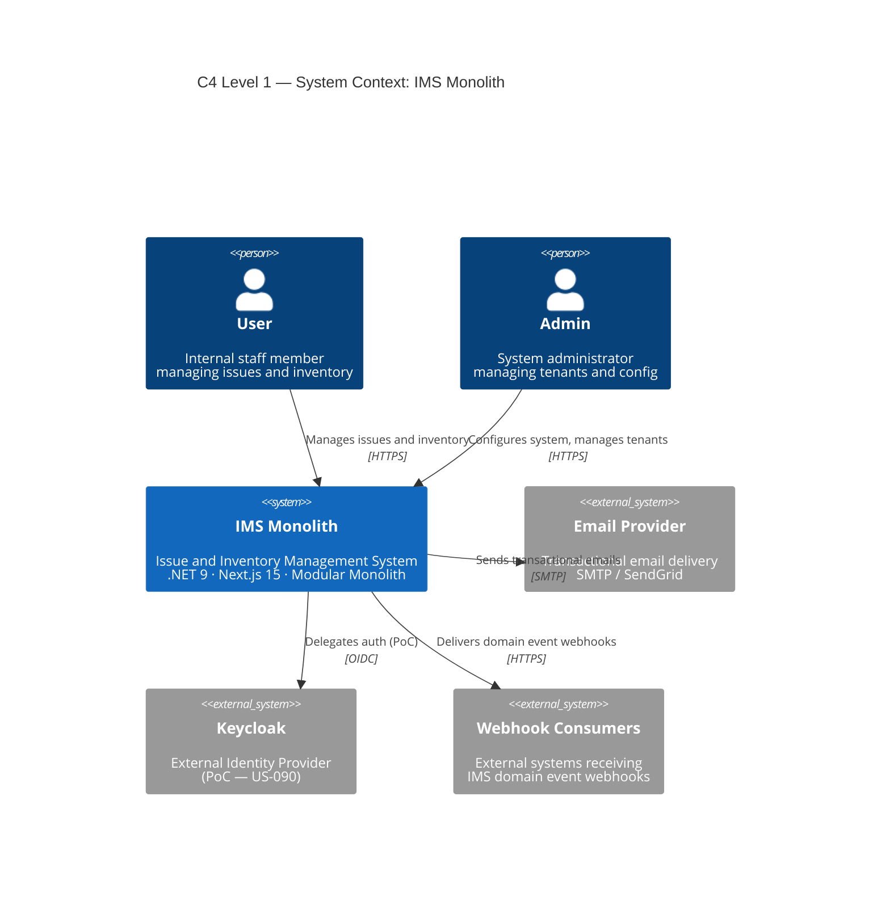
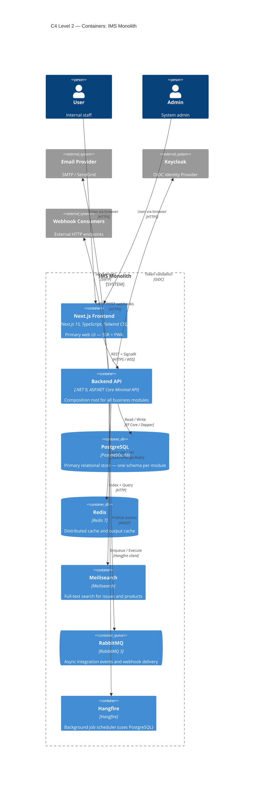
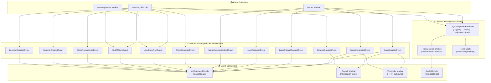
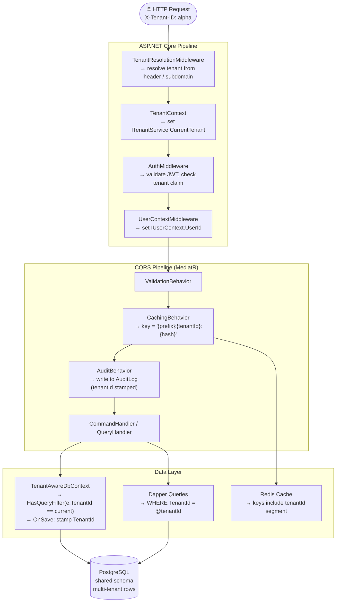

# IMS Architecture Documentation

> C4 diagrams, module dependency map, and multi-tenancy data flow for the IMS Modular Monolith.

## Diagrams

| Diagram | Description |
|---|---|
| [C4 Context](./c4-context.svg) | System boundaries and external actors |
| [C4 Container](./c4-container.svg) | Deployable containers and their relationships |
| [C4 Component](./c4-component.svg) | Backend API internal module breakdown |
| [Module Event Graph](./module-graph.svg) | Which modules publish / consume MediatR domain events |
| [Multi-Tenancy Flow](./multitenancy-flow.svg) | Request → middleware → CQRS → data with tenant isolation |

The Structurizr DSL source for all C4 levels lives in [`workspace.dsl`](./workspace.dsl).  
Mermaid source files live in [`src/`](./src/).

---

## C4 Level 1 — System Context



---

## C4 Level 2 — Containers



---

## Module Event Graph



---

## Multi-Tenancy Data Flow



> **Key invariant (fixed in US-080):** `CachingBehavior` includes `tenantId` in every cache key, preventing cross-tenant cache poisoning.

---

## Regenerating Diagrams Locally

```bash
# Install mermaid-cli once
npm install -g @mermaid-js/mermaid-cli

# Regenerate all SVGs
cd docs/architecture
for f in src/*.mmd; do
  name=$(basename "$f" .mmd)
  mmdc -i "$f" -o "${name}.svg" -t neutral -q
done
```

SVGs are also regenerated automatically on every merge to `main` via the [generate-diagrams](./.github/workflows/generate-diagrams.yml) GitHub Actions workflow.
